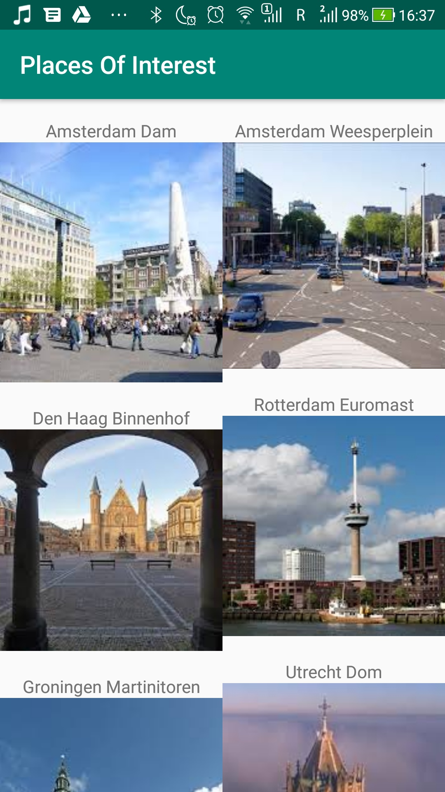
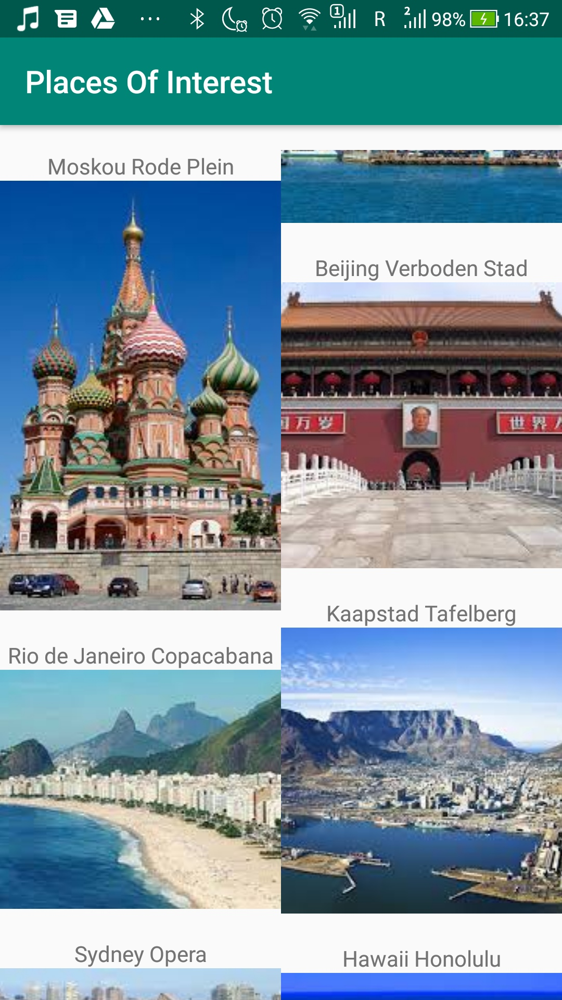
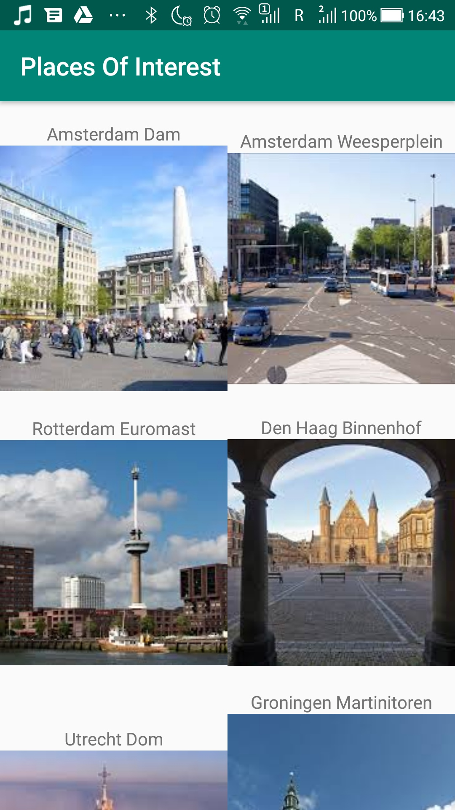

# Level 2 Learning Task 1 - Places of interest
This is the first task of the second level. It is very similar to the example task, it's easier because we don't need to handle the user input or use gestures to remove items from the list. At the same time, it's more difficult because now we need to work with more than 1 property in our data model and with another layout manager.
## What's inside
This is an app to make up a list of  places. 
## Screenshots with StaggeredGridLayoutManager
    
## Screenshots with GridLayoutManager
    
## Coclusion about layout managers
As we can see, the difference is that <i>GridLayoutManager</i> contains cells of the same size, while <i>StaggeredGridLayoutManager</i> contains cells of varying sizes.
